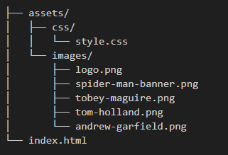

# Spider-Man: No Way Home - Página Informativa (HTML & CSS Básico)

Este projeto foi desenvolvido como parte do desafio de HMTL "Recriando a Wikipedia com Layout Moderno" da DIO.me, com o objetivo de praticar a estruturação de páginas web.

## 🌟 Sobre o Projeto

A página apresenta informações detalhadas sobre o filme "Spider-Man: No Way Home" (Homem-Aranha: Sem Volta para Casa), incluindo sua sinopse, contexto de produção e o elenco principal. O foco está na organização do conteúdo utilizando as tags HTML mais adequadas e na aplicação de estilos CSS para melhorar a experiência visual.

## ✨ Tecnologias Utilizadas

* **HTML5:** Para a estrutura e semântica do conteúdo.
* **CSS3:** Para estilizações básicas e organização visual da página.

## 🚀 Estrutura do Projeto

O projeto é composto por um arquivo HTML principal e uma folha de estilos CSS:

## 🌐 Como Visualizar o Projeto

Para visualizar este projeto em seu navegador:

1.  Clone este repositório para sua máquina local.
2.  Navegue até a pasta raiz do projeto.
3.  Abra o arquivo `index.html` em seu navegador web preferido.

## 📚 Aulas e Referências

* **Bootcamp:** Bootcamp Santander 2025 - Front-end - https://web.dio.me/track/santander-2025-front-end
* **DIO.me:** [https://www.dio.me/](https://www.dio.me/)
* **Conteúdo do Filme:** Resumos e informações adaptados do artigo de "Spider-Man: No Way Home", da Wikipedia - https://pt.wikipedia.org/wiki/Spider-Man:_No_Way_Home
